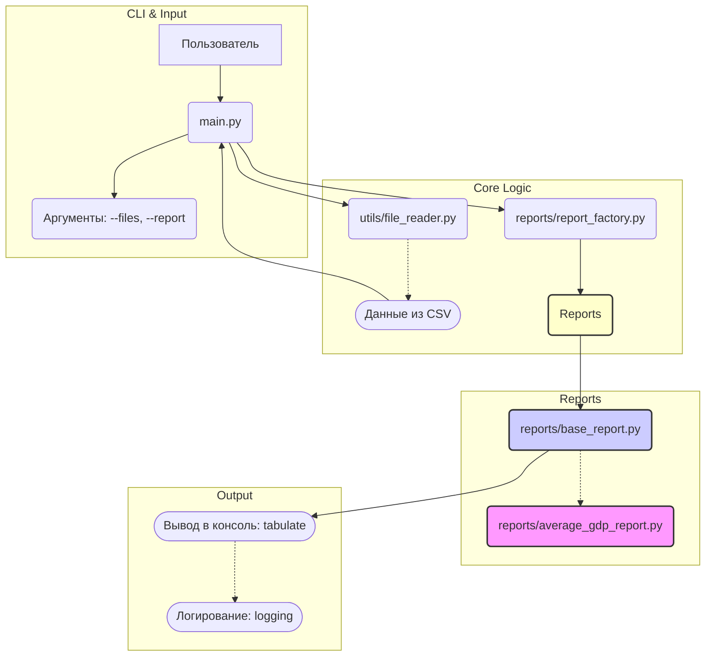

# CSV Macroeconomic Data Analyzer

CLI-инструмент для анализа макроэкономических данных из CSV-файлов и генерации отчетов.


---

## Описание проекта

Проект представляет собой консольное приложение на Python для обработки макроэкономических показателей (ВВП, инфляция, безработица и т.д.) из одного или нескольких CSV-файлов.


## Архитектура системы


### Основные возможности:

*   **Чтение данных:** Объединение данных из нескольких файлов.
*   **Генерация отчетов:** Поддержка различных типов отчетов через систему плагинов/фабрик.
*   **Тестирование:** Код покрыт тестами с использованием `pytest`.
*   **Стандарты:** Соблюдены PEP8, используется проверка типов `mypy` и линтинг `ruff`.

---

## Технологический стек

*   Python 3.12+
*   `argparse` (стандартная библиотека для аргументов CLI)
*   `csv` (стандартная библиотека для чтения CSV)
*   `logging` (стандартная библиотека для обработки ошибок)
*   `tabulate` (для красивого вывода таблиц в консоль)
*   `pytest`, `pytest-cov`, `ruff`, `mypy` (инструменты разработки)

---

## Установка и запуск

Для управления зависимостями используется **Poetry**.

### Клонирование репозитория

```bash
git clone https://github.com/Maksim-Gubenin/CSV-macroeconomic-data-analyzer
cd csv-macroeconomic-data-analyzer
```

### Установка зависимостей с помощью Poetry
Убедитесь, что у вас установлен [Poetry](https://python-poetry.org).

```bash
# Установка всех зависимостей (включая dev-зависимости для тестов)
poetry install
```
### Пример запуска скрипта

Скрипт принимает два обязательных параметра: `--files` (пути к файлам через пробел) и `--report` (тип отчета, например, `average-gdp`).

```bash
poetry run python3 main.py --files test_data/economic1.csv test_data/economic2.csv --report average-gdp
```

**Пример вывода в консоль:**


---

## Запуск тестов

Для запуска тестов и проверки покрытия кода используйте Poetry:

```bash
poetry run pytest --cov=. --cov-report=term
```

## Архитектура: Добавление новых отчетов

Архитектура проекта спроектирована так, чтобы добавление новых типов отчетов было максимально простым:

1.  **Создайте новый класс** отчета в директории `reports/`, унаследовав его от абстрактного класса `BaseReport`.
2.  **Реализуйте метод `generate(self, data: list) -> dict`**, который обрабатывает сырые данные и возвращает словарь с заголовками и строками для `tabulate`.
3.  **Зарегистрируйте новый отчет** в файле `reports/report_factory.py`, добавив строку:
   
    ```python
    ReportFactory.register_report("your-report-name", YourNewReportClass)
    ```

После этого новый отчет будет автоматически доступен для выбора через параметр `--report` в командной строке.

## Автор
### Максим Губенин

- **Telegram:** @SKDM25: https://t.me/SKDM25
- **Email:** maksimgubenin@mail.ru
